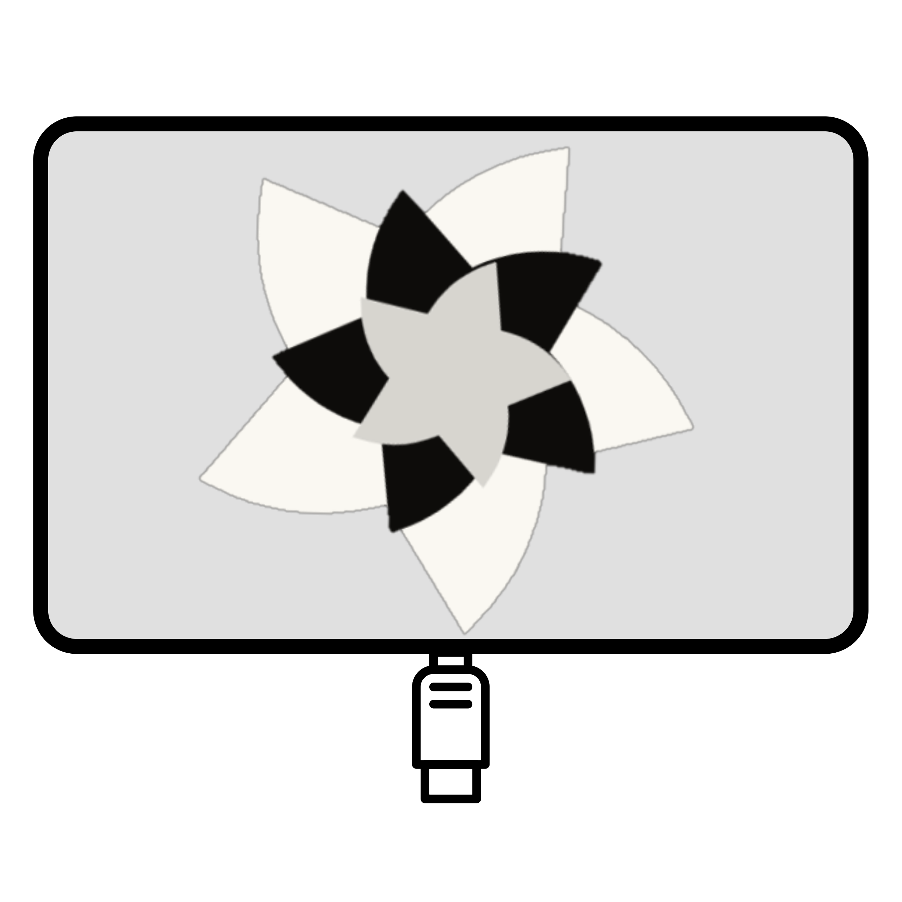

# Darksplay



Darksplay es un proyecto experimental que busca permitir utilizar un dispositivo
Android como monitor extendido de una computadora. Actualmente incluye el
bootstrap y un PoC V0.1-A de vídeo sintético H.264 sobre ADB/USB físico.
Todavía no ofrece un monitor extendido ni captura del escritorio.

La primera plataforma host será Fedora Linux con GNOME y Wayland; el cliente
inicial será Android. La separación del núcleo y los backends permitirá evaluar
Windows posteriormente, sin vincular el diseño a fabricantes o hardware de prueba.

## Implemented

- Host mínimo C++20/CMake: imprime `Darksplay host 0.0.1-dev` y termina con código 0.
- CTest sin frameworks externos: comprueba salida y código de terminación.
- Android Kotlin `io.darkstar.darksplay`: receiver explícito, MediaCodec y
  SurfaceView; Gradle Wrapper y APK debug compilado.
- PoC GStreamer/OpenH264 1280×720/30 FPS por ADB/USB físico, validado en Android
  real durante 60 segundos; véase [procedimiento y límites](docs/VIDEO_POC.md).
- Arquitectura, propuesta conceptual de protocolo, privacidad y roadmap.
- Logo oficial conservado como recurso fuente, sin modificaciones.

## Planned

- Integración de sesión/control y negociación: V0.1 todavía no está completo.
- Captura PipeWire, escritorio extendido, aceleración y entrada touch/stylus.
- Backend Windows en una etapa futura.

V0.x usará exclusivamente ADB mediante USB físico. No se implementan transportes
Wi-Fi, Ethernet o Bluetooth, ni servidores HTTP/WebSocket.

## Arquitectura y privacidad

El flujo futuro separa display, captura y encoder del Core, protocolo y transporte.
Android no necesita conocer el sistema operativo host. Ninguna dependencia de
GNOME, PipeWire o Windows forma parte del núcleo común.

El runtime será local-first, sin cloud, cuentas, telemetría ni analytics. Una
sesión USB no requerirá Internet. Conectar el cable no iniciará una sesión:
el cliente deberá estar abierto y listo y el host deberá iniciar explícitamente
la sesión. Las herramientas de desarrollo pueden usar Internet.

## Compilar y validar el host mínimo

Requisitos actuales: CMake 3.20 o posterior, compilador C++20 (inicialmente GCC)
y herramienta de build compatible con el generador CMake disponible. Ninja no
es requisito. No se necesitan todavía GStreamer, PipeWire ni ADB para compilar.

```sh
cmake -S . -B build
cmake --build build
ctest --test-dir build --output-on-failure
./build/host/darksplay-host
```

Si el entorno resuelve GCC mediante `ccache` y su caché predeterminada no es
escribible, puede mantenerse la caché dentro del proyecto, sin cambiar el sistema:

```sh
CCACHE_DIR="$PWD/build/.ccache" cmake -S . -B build
CCACHE_DIR="$PWD/build/.ccache" cmake --build build
```

## Documentación

- [Vídeo PoC V0.1-A](docs/VIDEO_POC.md)
- [Arquitectura](docs/ARCHITECTURE.md)
- [Protocolo conceptual](docs/PROTOCOL.md)
- [Privacidad](docs/PRIVACY.md)
- [Roadmap](docs/ROADMAP.md)

La licencia está [pendiente de decisión](LICENSE). El logo e icono oficial es
`assets/branding/Darksplay.png`; su diseño, colores y proporciones deben conservarse.
