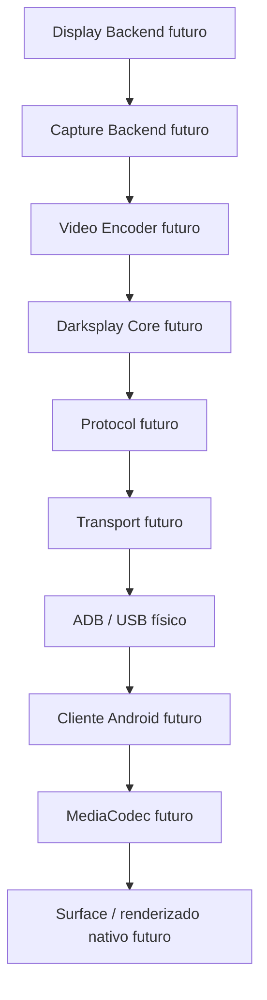
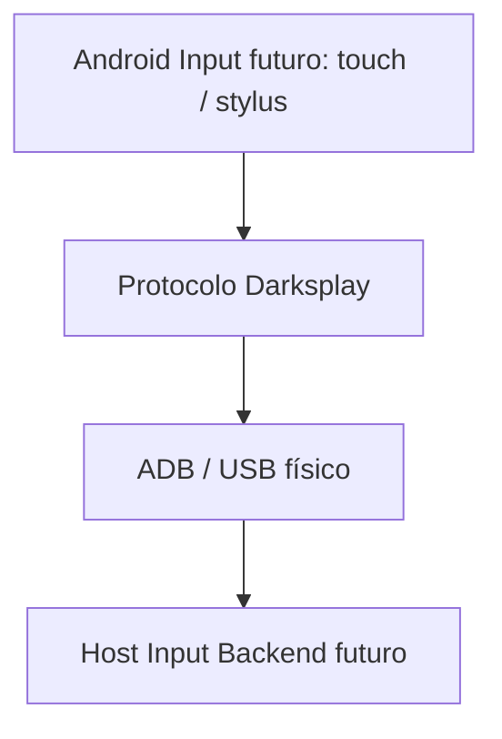

# Arquitectura

Darksplay busca convertir Android en un monitor extendido. Están implementados
el host informativo, su prueba y un receiver Android experimental de vídeo sintético.
V0.1-A usa `gst-launch-1.0`/OpenH264, un script específico de ADB/USB y
MediaCodec/SurfaceView; véase [el PoC](VIDEO_POC.md). No se implementa todavía Core
ni un backend de display/captura. Los diagramas describen la arquitectura futura,
no interfaces ya fijadas ni un escritorio extendido funcional.

## Responsabilidades

- **Host:** aplicación C++20 que coordinará inicio explícito, sesión y cierre.
- **Core:** estado y coordinación comunes. No dependerá de Linux, GNOME, Mutter,
  PipeWire, VA-API ni APIs Windows: esas dependencias impedirían reutilizarlo.
- **Platform Backend:** display virtual, captura y entrada específicos del SO.
  Linux será primero; el mecanismo de monitor virtual sigue sin decidirse.
- **Encoder:** producción de vídeo comprimido. GStreamer gestionará las futuras
  pipelines multimedia; OpenH264 será la codificación inicial y la aceleración
  podrá añadirse después. No se inicializa multimedia en Fase 0.
- **PipeWire:** futura captura Linux, con integración apropiada GNOME/Wayland.
  No crea por sí solo el monitor virtual requerido por Darksplay.
- **Protocol:** significado de mensajes y negociación, independiente del SO y
  del mecanismo de transporte. Todavía no hay serialización implementada.
- **Transport:** entrega de mensajes. V0.x exclusivamente ADB sobre USB físico.
  ADB es el mecanismo de comunicación con Android, no un codec ni el protocolo.
  V0.1-A prueba un forwarding entre sockets Unix locales; el control plane
  y la integración definitiva quedan pendientes.
- **Android:** V0.1-A ya prueba MediaCodec/SurfaceView para H.264 sintético fijo.
  La negociación de capacidades sigue pendiente.

## Sesión y recursos

El cable no inicia automáticamente una sesión. El cliente deberá estar abierto y
explícitamente listo; el host iniciará la sesión tras comprobar esa disponibilidad.
La política exacta de disponibilidad, consentimiento y handshake se revisará antes
de V0.1. Cierre normal, desconexión y errores deberán liberar pipelines, buffers,
handles de transporte y recursos del backend. No existe daemon ni sesión en Fase 0.

## Portabilidad sin sobreingeniería

Se crearán interfaces cuando una responsabilidad real lo requiera. Hoy no hay
biblioteca Core vacía ni stubs Windows. Los futuros módulos comunes evitarán APIs
de plataforma; cada backend contendrá sus propias dependencias. Windows podrá
implementar captura, display y aceleración nativos sin cambiar el significado del
protocolo ni exigir que Android conozca el SO host.

Otros transportes podrán estudiarse después de V0.x, manteniendo USB plenamente
local y sin Internet. No se crean servicios de red alternativos.
