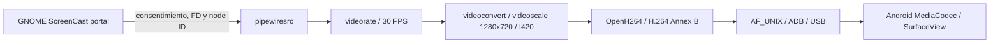
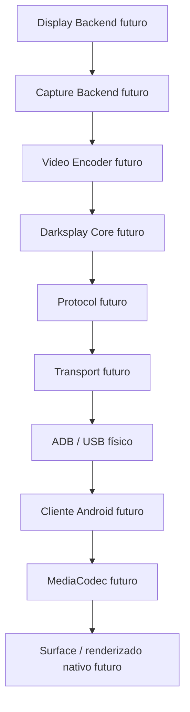
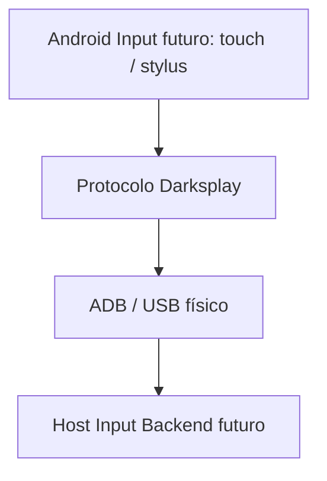

# Arquitectura

Darksplay busca convertir Android en un monitor extendido. Están implementados
el host informativo, el receiver Android experimental y V0.2: captura real de
un monitor mediante `xdg-desktop-portal ScreenCast` + PipeWire, GStreamer/OpenH264
y ADB/USB físico. V0.3 añade ScreenCast VIRTUAL (`source_type=4`): GNOME
materializa Meta-0 tras negociar PipeWire y lo incorpora como monitor extendido
independiente. La prueba física confirmó ventanas visibles en Android y eliminación
de Meta-0 con Stop; véase [VIRTUAL_POC.md](VIRTUAL_POC.md). V0.1-A y V0.1-B se conservan como evidencia
histórica en [VIDEO_POC.md](VIDEO_POC.md) y [SESSION_POC.md](SESSION_POC.md).

## Responsabilidades

- **Host:** aplicación C++20 que coordinará inicio explícito, sesión y cierre.
- **Core:** estado y coordinación comunes. No dependerá de Linux, GNOME, Mutter,
  PipeWire, VA-API ni APIs Windows: esas dependencias impedirían reutilizarlo.
- **Platform Backend:** display virtual, captura y entrada específicos del SO.
  V0.2 implementa la captura Linux mediante el portal ScreenCast de GNOME y
  PipeWire; V0.3 selecciona VIRTUAL mediante la misma API pública del portal.
- **Encoder:** producción de vídeo comprimido. GStreamer gestiona el pipeline actual; OpenH264 realiza la codificación
  software. La aceleración podrá añadirse después. No se inicializa multimedia en Fase 0.
- **PipeWire:** backend actual de captura Linux, integrado mediante
  `xdg-desktop-portal ScreenCast` en GNOME/Wayland. El portal solicita
  consentimiento explícito, selecciona un monitor único con cursor embebido y
  sin persistencia, y entrega el FD autorizado y el node ID a GStreamer. No
  selecciona libremente fuentes Wayland sin una sesión autorizada. En V0.3,
  la negociación del stream VIRTUAL con caps BGRx 1280×720 permite que GNOME
  materialice Meta-0; no se usa DisplayConfig para crearlo.
- **Protocol:** significado de mensajes y negociación, independiente del SO y
  del mecanismo de transporte. V0.1-B experimenta con JSON Lines, sin serialización definitiva.
- **Transport:** entrega de mensajes. V0.x exclusivamente ADB sobre USB físico.
  ADB es el mecanismo de comunicación con Android, no un codec ni el protocolo.
  V0.1-A prueba forwarding entre sockets Unix locales; V0.1-B añade
  control separado ([sesión experimental](SESSION_POC.md)). La integración definitiva sigue pendiente.
- **Android:** V0.1-A ya prueba MediaCodec/SurfaceView para H.264 sintético; V0.1-B recibe parámetros por VIDEO_CONFIG.
  La negociación de capacidades sigue pendiente.

## Backend actual de captura

En V0.2 la ruta ejecutable es:

En MONITOR el consentimiento del portal ocurre antes del handshake. En VIRTUAL,
Start en Android envía HELLO; el host responde HELLO_ACK y VIDEO_CONFIG. Solo tras
VIDEO_CONFIG_ACK abre el portal VIRTUAL. La fuente añade caps explícitas
`video/x-raw,format=BGRx,width=1280,height=720` antes del resto del pipeline.
El modo observado de Meta-0 es 60 Hz; la salida codificada sigue a 30 FPS nominales. Mientras el streaming está activo, un dispatcher GLib recibe
`org.freedesktop.portal.Session.Closed`. La revocación confirmada marca
`source_revoked`, recolecta GStreamer, cierra control/vídeo y termina con exit
2. El GOODBYE usa el reason existente `transport_closed`; un exit 1 sin
revocación confirmada sigue siendo un error inesperado.

La captura física ya fue validada con imagen cambiante y con una pantalla
estática durante más de 15 s seguida de movimiento. Esto no constituye una
medición de latencia o fluidez. No hay reconexión ni inicio automático; Stop del
receiver, pérdida de USB y revocación del portal liberan procesos, sockets y
forwards mediante cleanup idempotente.

## Sesión y recursos

El cable no inicia automáticamente una sesión. El cliente deberá estar abierto y
explícitamente listo: Android inicia el protocolo con HELLO tras Start. El endpoint
de control puede existir antes, sin sesión ni vídeo. El host espera HELLO sin
límite inicial; Ctrl+C antes de HELLO limpia sin enviar GOODBYE. No hay READY.
En V0.2 el portal solicita consentimiento de GNOME antes de los timeouts y del
handshake. Cierre normal, desconexión, pérdida de USB, Stop y revocación del
portal liberan pipelines, buffers, handles de transporte y recursos del backend.
No hay reconexión automática ni daemon Darksplay.

## Portabilidad sin sobreingeniería

Se crearán interfaces cuando una responsabilidad real lo requiera. Hoy no hay
biblioteca Core vacía ni stubs Windows. Los futuros módulos comunes evitarán APIs
de plataforma; cada backend contendrá sus propias dependencias. Windows podrá
implementar captura, display y aceleración nativos sin cambiar el significado del
protocolo ni exigir que Android conozca el SO host.

Otros transportes podrán estudiarse después de V0.x, manteniendo USB plenamente
local y sin Internet. No se crean servicios de red alternativos.
