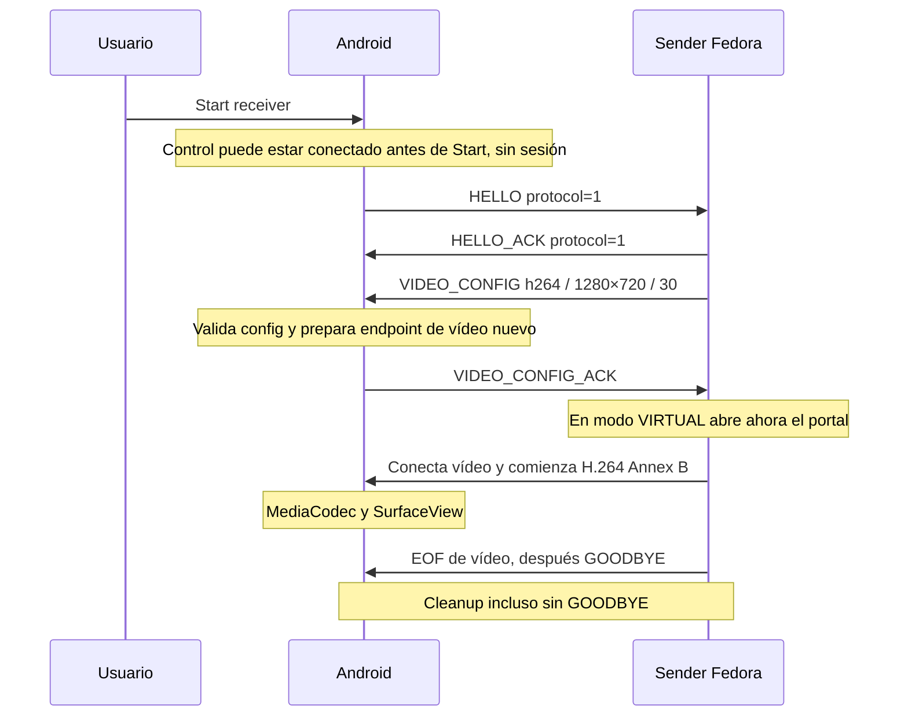

# Sesión PoC V0.1-B — inicio actualizado en V0.3

El experimento original V0.1-B descrito en la evidencia histórica fue sobre V0.1-A, no protocolo definitivo ni V0.1 completo. La bola se
**genera en Fedora mediante `videotestsrc pattern=ball`**, se codifica con OpenH264
y se transmite por USB. Android recibe, decodifica y renderiza; no genera la
animación. No hay captura de pantalla, PipeWire, display virtual ni monitor
extendido. No se midió latencia extremo a extremo.

La implementación actual invierte HELLO: Android lo envía tras Start. La fuente
sintética se selecciona con `--videotestsrc`; la integración de escritorio extendido
validada se documenta en [VIRTUAL_POC.md](VIRTUAL_POC.md).

## Dos canales de una sesión

- Control: socket Unix del host → ADB forward USB → Android
  `localabstract:io.darkstar.darksplay.control`.
- Vídeo: GStreamer/fdsink → socket Unix del host → ADB forward USB → Android
  `localabstract:io.darkstar.darksplay.video` → AnnexBReader → MediaCodec → SurfaceView.

Son dos forwards privados, con rutas temporales nuevas por ejecución; no hay
listeners TCP/UDP de Darksplay, permisos Internet, cloud ni transporte inalámbrico.
El sender exige un dispositivo autorizado que ADB identifica con `usb:`.
No añade dependencias: Python estándar y APIs JSON nativas Android.
El host C++ sigue siendo el ejecutable informativo de Fase 0.

## Control experimental

Una línea UTF-8 terminada en LF contiene exactamente un objeto JSON. Máximo
**4096 bytes antes del LF**, suficiente para estos cinco mensajes pequeños y
acotado incluso si nunca llega el delimitador. Se rechazan UTF-8/JSON inválidos,
claves duplicadas, campos extra, tipos incorrectos y mensajes fuera de secuencia.
Android admite campos escalares string/entero, sin coerción de floats o booleanos.

Mensajes y dirección actuales:

```json
{"type":"hello","protocol":1}
{"type":"hello_ack","protocol":1}
{"type":"video_config","codec":"h264","width":1280,"height":720,"fps":30}
{"type":"video_config_ack"}
{"type":"goodbye","reason":"completed"}
```

Android envía HELLO tras Start y VIDEO_CONFIG_ACK. Host responde HELLO_ACK,
envía VIDEO_CONFIG y, cuando corresponde, GOODBYE.
`protocol=1` no negocia rangos. Solo `codec=h264` está soportado; Android exige
enteros `width=1..1920`, `height=1..1080`, `fps=1..60`. Son límites conservadores
del PoC, no promesas de soporte para cada combinación ni capabilities finales.
`reason` es texto diagnóstico de hasta 128 caracteres; no taxonomía definitiva.
No hay READY, PING, CONFIG genérico, VIDEO_FRAME ni negociación de capacidades.
JSON Lines y Annex B + AUD son decisiones experimentales, no formatos Darksplay 1.0.

## Orden y estados



Android: WAITING → CONNECTED → HELLO_SENT → HELLO_OK → CONFIGURED → STREAMING → CLOSING → CLOSED.
Errores/Stop/lifecycle pueden terminar desde cualquier estado. El host mantiene
CONNECTED → HELLO_OK → CONFIGURED → STREAMING → CLOSING → CLOSED.
El callback que conecta vídeo y crea GStreamer solo se invoca tras ambos ACK.
Android prepara el endpoint de vídeo antes de escribir CONFIG_ACK (para evitar
una carrera de conexión), pero no inicia su worker hasta escribir ese ACK.
El vídeo no lleva mensajes Darksplay por frame.

VIDEO_CONFIG validada crea `VideoConfig`; VideoReceiver usa su MIME (`h264` →
`video/avc`), dimensiones y FPS en MediaFormat y los FPS para los PTS nominales.
SPS/PPS siguen procediendo del stream Annex B. No se implementa comparación
completa SPS/config ni un parser general H.264.

## Timeouts y cierre

- Host: espera del primer byte de HELLO sin límite; Ctrl+C limpia sin GOODBYE
  antes de HELLO válido. Conexión Unix y resto de envíos/lecturas: 5 s. Lectura con plazo
  absoluto por línea; recibir bytes lentamente no extiende el handshake.
- Android: HELLO_ACK, VIDEO_CONFIG y líneas parciales: 5 s. `Os.poll` del descriptor
  de control en intervalos de 250 ms permite comprobar el plazo y despertar al
  cerrar el socket. No se depende de la clase de excepción de SO_TIMEOUT nativa.
- Espera inicial de usuario/host: sin límite, cancelable con Stop/lifecycle.
  Antes de Start, el worker Android revisa cierre/error del control cada 50 ms;
  `poll` y `MSG_PEEK` distinguen EOF sin consumir mensajes. Start/Stop despiertan
  la espera inmediatamente. EOF ejecuta cleanup sin HELLO ni vídeo; no reconecta.
- Vídeo: accept y lectura existentes con límite de 5 s. Mientras el worker de
  vídeo vive, un control ocioso completo puede continuar sin mensajes/keepalive;
  una línea parcial nunca extiende su plazo. Al acabar vídeo se espera control
  hasta 5 s, luego se termina si no llegó GOODBYE.
- Join de vídeo: hasta 3 s por intento, solo en worker de control. Proceso host:
  SIGINT/espera 3 s → terminate/espera 2 s → kill/recolección.

En completion el host hace shutdown de escritura de vídeo, envía GOODBYE y
comprueba EOF de control. Android permite drenar vídeo, libera decoder y cierra
control. GOODBYE no es requisito: EOF, excepciones, Stop, onStop y surfaceDestroyed
cierran también. Control EOF durante streaming se informa como `transport_closed`
(exit 2), aunque GStreamer atienda SIGINT y termine en 0. SIGPIPE solo se clasifica
como transporte cerrado con evidencia de cierre del peer; otros fallos siguen
siendo errores (exit 1), incluso si coinciden con EOF de control. No se infiere si fue Stop, lifecycle o desconexión física.

## Ownership

SessionReceiver posee un worker de control, su listener y socket aceptado, y un
único VideoReceiver creado con esa configuración. El listener de control se cierra
tras aceptar una conexión. VideoReceiver posee su worker, listener/socket y codec;
acepta una conexión y cierra su listener. MediaCodec se libera en finally.
Stop cierra/shutdown ambos canales y despierta accept/poll/read. La UI no hace
joins y Start permanece deshabilitado durante el cierre del receiver anterior.
Recrear la Surface no cambia esa regla. Tras el callback de cleanup, si la Activity
está reanudada y la Surface es válida, se prepara un nuevo endpoint técnico.
Solo su callback de preparación habilita Start; esto no envía HELLO ni reconecta
al host. Los callbacks de receivers anteriores no pueden reemplazar al actual.
Un fallo preparando el endpoint no se reintenta automáticamente.
Al abrir la Activity con Surface disponible se prepara solo control. Start
autoriza HELLO; si no queda receiver, crea recursos nuevos. No hay retry de
conexión ni reconexión automática de sesión. Esta asociación por lifecycle no es autenticación ni emparejado.

El sender posee sockets, proceso GStreamer, directorio TemporaryDirectory y una
lista de forwards creados exitosamente por esa ejecución. Finally recolecta el
proceso y cierra sockets; elimina únicamente esos forwards y su directorio,
también ante error/interrupción. No usa shell=True ni comandos shell construidos.

## Reproducir y probar

Compilar e instalar como en [Android README](../android/README.md), abrir Darksplay
y pulsar Start receiver. Con un único dispositivo USB autorizado:

```sh
python3 tools/video-poc.py --videotestsrc --seconds 10
# O seleccionar explícitamente:
python3 tools/video-poc.py --serial SERIAL --videotestsrc --seconds 10
```

El pipeline y sus parámetros OpenH264 permanecen los de [V0.1-A](VIDEO_POC.md).
Con endpoint técnico preparado, el host espera Start sin transmitir HELLO.
Si la app no está abierta o el endpoint terminó, la conexión puede fallar; no hay retry.
`adb forward --list` debe quedar igual que antes de ejecutar el sender.

Pruebas Python de sender real, framing, ACK gates y cleanup:

```sh
python3 -m unittest discover -s tests -p 'test_*.py'
```

`SessionProtocolCheck.java` se compila con las clases Kotlin reales de
`app/build/intermediates/built_in_kotlinc/debug/compileDebugKotlin/classes` y el
kotlin-stdlib del build. Comprueba estados, HELLO/config/GOODBYE, parámetros,
UTF-8, límite, EOF y timeout. `AnnexBReaderCheck` conserva la regresión del parser.
No hay implementación productiva duplicada en los tests.

`ReceiverLifecycleCheck.java` usa el mismo classpath Kotlin y JDK: comprueba la
espera productiva `StartGate` con sockets Unix reales (EOF, cierre completo, Stop
y Start), cleanup y ausencia de HELLO/vídeo antes de autorización. Comprueba además
el estado productivo `ReceiverLifecycle`: Surface recreada durante cierre,
preparación del reemplazo y rechazo de callbacks antiguos. La detección de EOF
antes de Start mediante `Os.poll`/`MSG_PEEK` fue validada en Android físico:
al cerrar el host con Ctrl+C, Android detectó EOF, no envió HELLO ni inició vídeo,
liberó recursos y preparó posteriormente un nuevo endpoint. La carrera específica
Surface recreation + CLOSING no fue reproducida físicamente; permanece cubierta
por `ReceiverLifecycleCheck`. Estos checks JVM no sustituyen una prueba física.

Check físico opt-in (app abierta, USB autorizado; pulsa Start/Stop, sin GStreamer):

```sh
python3 tests/check_session_device.py --serial SERIAL
```

Comprueba JSON real Android, versión/type/orden, duplicados, UTF-8, límite,
config inválida, EOF y timeout; cada rechazo debe devolver EOF y habilitar Start.
También Stop esperando host y durante handshake. Resuelve los botones por ID,
no por coordenadas fijas. El dump temporal UI se guarda en `/data/local/tmp`;
no cambia ajustes del dispositivo.

Validación manual adicional: sesión normal, Stop en vídeo, desconexión USB durante
negociación y vídeo, reconexión sin inicio automático. Observar bola, parámetros,
logs HELLO/ACK y CONFIG/ACK antes de GStreamer, GOODBYE/decoder stopped/CLOSED,
UI utilizable y ausencia de forwards propios residuales. Logs:

```sh
adb -s SERIAL logcat -v time -s DarksplaySession:I DarksplayVideo:I AndroidRuntime:E
```

## Evidencia histórica V0.1-B (handshake anterior)

Esta tabla conserva los resultados anteriores a invertir HELLO; no describe
el comportamiento actual antes de Start. El check físico adaptado al nuevo
handshake no se volvió a ejecutar en la consolidación.

Validación con Android físico por USB (hardware de prueba, sin dependencia del
fabricante):

| Prueba | Resultado |
| --- | --- |
| A: sesión normal | 10 s, 300 frames renderizados, HELLO/ACK y CONFIG/ACK antes de vídeo; GOODBYE, decoder liberado y forwards eliminados. Bola visible y UI h264/1280×720/30 FPS. |
| B: Stop esperando host | Stream finished; listener/worker terminados y Start habilitado. |
| C: Stop durante handshake | Después de HELLO_ACK y antes de CONFIG; EOF, sin vídeo/codec, sesión cerrada y UI utilizable. |
| D: Stop en streaming | 398 frames renderizados; codec liberado y CLOSED. Sender exit 2 transport_closed (GStreamer exit 0 por interrupción); sin forwards residuales. |
| E: USB durante handshake | No realizada físicamente: no se coordinó una desconexión dentro del plazo de handshake de 5 s. EOF/timeout y bloqueo de vídeo están cubiertos por tests; no equivalen a esta prueba física. |
| F: USB durante vídeo | Usuario observó Session error: Control EOF; log confirma 574 frames y codec liberado/CLOSED. Sender exit 2 transport_closed; GOODBYE ausente y cleanup independiente. |
| G: reconexión | Sin inicio automático, Start habilitado/Stop deshabilitado y sin forwards. Intentar sender sin Start falla con Control EOF antes de GStreamer. Nueva sesión explícita: 3 s/90 frames, GOODBYE y cleanup correctos. |

Los 15 casos de control físico del check opt-in cerraron la sesión y recuperaron
la UI. Tests Python: 23 aprobados (17 de sesión y 6 de regresión V0.1-A); checks
Kotlin de sesión y AnnexBReader aprobados, incluyendo stream real de 90 AU.
CMake/build/CTest 1/1 y host informativo correctos.

Al desconectar USB, los intentos de adb forward --remove informaron device not
found. ADB eliminó los forwards asociados al transporte perdido: tras reconectar
la lista estaba vacía. El cleanup conserva ese diagnóstico, no lo declara una
eliminación exitosa por comando.

La primera prueba
reveló que LocalSocket SO_TIMEOUT devolvía IOException `Try again`, cortando
control tras seis frames. Se sustituyó por poll Unix y la sesión normal posterior
completó 10 s/300 frames, ambos ACK, GOODBYE, codec liberado y forwards eliminados.
No se midió latencia extremo a extremo; FPS y tiempo de sesión no la sustituyen.
EOF/SIGPIPE no identifican el motivo exacto de desconexión. Continúan pendientes
capabilities, métricas formales, protocolo definitivo y revisión para integrar
V0.1. No se implementan captura, monitor virtual ni fases posteriores.
